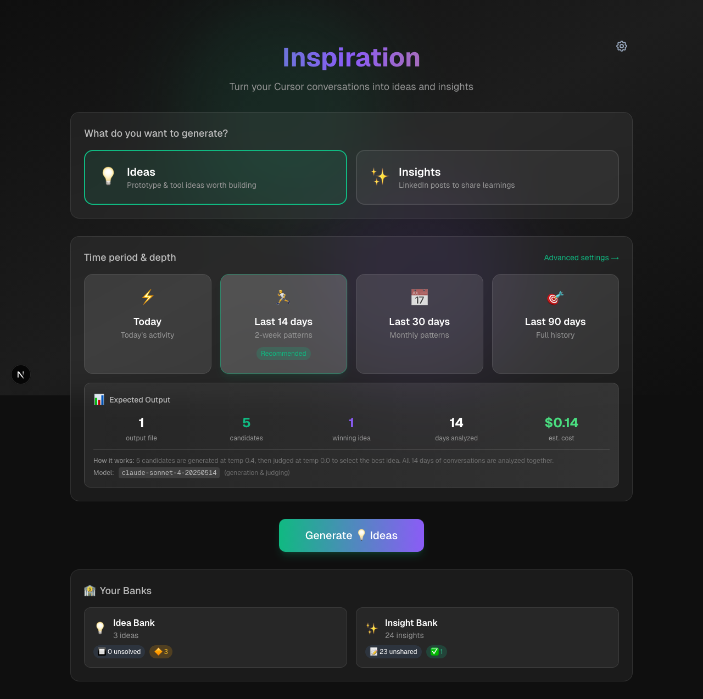

# 🔥 Dad Aura

**A playful, emoji-driven app where my son rates my dad performance in real-time.** He sends emoji + points from his Apple Watch; I see my aura score update instantly. Track trends, celebrate wins, learn from fails.



---

## 🚀 See It Running

### Option A: Auto-Generate Server Scripts (Recommended)

In Cursor Chat, type:

```
@Generate-server-scripts.md @dad-aura
```

This creates `start-servers.sh`, `stop-servers.sh`, and `check-servers.sh` for one-command startup.

### Option B: Manual Quick Start

```bash
npm install
cp env.example .env.local
npm run dev
```

Open **http://localhost:3000** in your browser.

**Note:** Full functionality requires Supabase database setup—see Environment Variables below.

---

## ✨ Features

- **Real-time aura tracking** — Current score with glowing visualizations (supports negative values!)
- **Dad Flip power** — Reverse your aura score (e.g., -200 → +200), but son controls how many flips per day
- **Son's control panel** — Son sets the flip limit (0-10 per day) and can change it anytime
- **Trend analytics** — See performance: today, 7 days, 30 days
- **Apple Watch input** — Son sends emoji + points via SMS for instant feedback
- **Dynamic UI** — Color and glow changes based on your score

## 🎯 How It Works

**For Son (Aura Giver):**
1. Text dad's phone number from Apple Watch
2. Send emoji + points (e.g., "🔥 +10" or "💩 -5")
3. Dashboard updates in real-time

**For Dad (Aura Receiver):**
1. Open dashboard to see current score
2. Use flip power to reverse negative aura (limited by son!)
3. View trends and activity feed
4. Learn, improve, become legendary 🎯

### Emoji Presets

| Positive | Points | Negative | Points |
|----------|--------|----------|--------|
| 🔥 | +10 | 💩 | -5 |
| 🎉 | +15 | 😤 | -8 |
| ❤️ | +5 | 😡 | -10 |
| ⚡ | +25 | 💔 | -12 |
| 🎯 | +20 | 👎 | -3 |

## 🔑 Environment Variables

Create `.env.local` from `env.example`:

| Variable | Required | Description |
|----------|----------|-------------|
| `NEXT_PUBLIC_SUPABASE_URL` | ✅ | Supabase project URL |
| `NEXT_PUBLIC_SUPABASE_ANON_KEY` | ✅ | Supabase anonymous key |
| `VONAGE_API_KEY` | ✅ | Vonage (for SMS receiving) |
| `VONAGE_API_SECRET` | ✅ | Vonage authentication |
| `VONAGE_PHONE_NUMBER` | ✅ | Your Vonage phone number |

### Database Setup

Run `supabase/schema.sql` in your Supabase SQL Editor to create the `aura_events` table.

## 🚢 Deployment

Deploy to Vercel:

```bash
vercel --prod
```

Then configure Vonage webhook to point to `https://your-domain.vercel.app/api/sms-webhook`.

---

## 💭 What I Learned

The tech came together quickly—SMS webhook → Supabase real-time → instant dashboard. But what surprised me: my son controlling how many times I can "flip" negative scores became the most engaging feature. That power asymmetry created negotiation moments that strengthened our relationship more than the scoring itself.

## 🔮 What's Next

Working on **AI guardrails that go beyond content filtering**—teaching the system when to say no, when to disagree with dad or child, and how to nurture healthy values in both. Sometimes refusing to change aura points *is* the ethical choice.

---

**Status:** Active Development  
**Stack:** Next.js 14 · TypeScript · Supabase · Tailwind · Vonage SMS  
**Goal:** Achieve legendary dad status (500+ points) 🎯

See `CLAUDE.md` for detailed technical setup and development commands.
